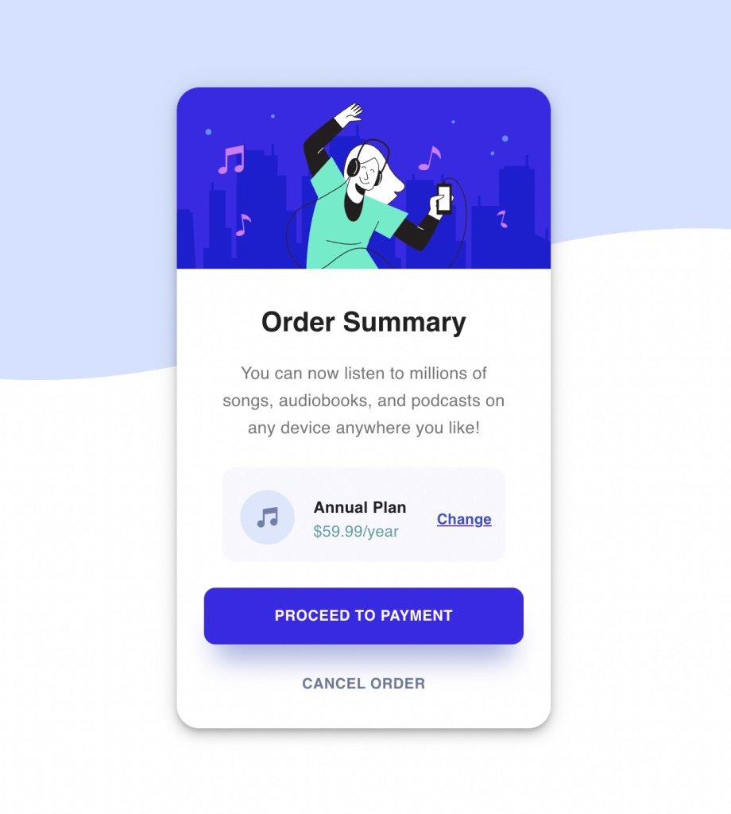
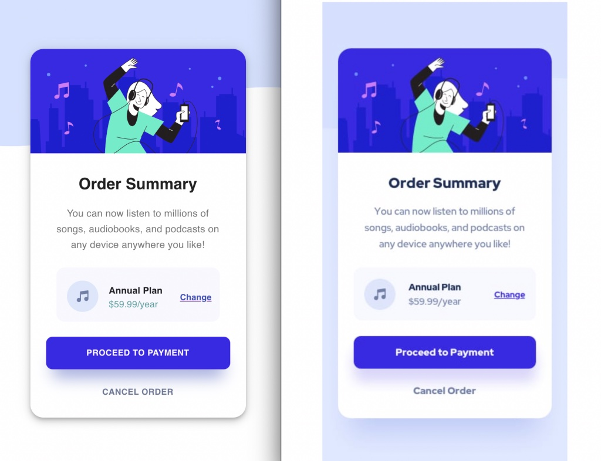

# Frontend Mentor - Order summary card solution

This is a solution to the [Order summary card challenge on Frontend Mentor](https://www.frontendmentor.io/challenges/order-summary-component-QlPmajDUj).

## Table of contents

- [Frontend Mentor - Order summary card solution](#frontend-mentor---order-summary-card-solution)
  - [Table of contents](#table-of-contents)
  - [Overview](#overview)
    - [The challenge](#the-challenge)
    - [Demo](#demo)
    - [Solution Screenshot](#solution-screenshot)
    - [Side-By-Side-Mobile](#side-by-side-mobile)
    - [Comparison](#comparison)
    - [Links](#links)
    - [Built with](#built-with)
    - [What I learned](#what-i-learned)
    - [Backlog](#backlog)
    - [Useful resources](#useful-resources)
  - [Acknowledgments](#acknowledgments)

## Overview

### The challenge

- Build the Order Component which looks as closely as the design template
- Users should be able to see hover states for interactive elements

### Demo

[Solution Demo](https://vigorous-wright-d3c341.netlify.app/)

### Solution Screenshot

### Side-By-Side-Mobile

- Left: my solution
- Right: design template

### Comparison

- Left: my solution
- Right: design template

### Links

- Solution URL: [Add solution URL here](https://your-solution-url.com)
- Live Site URL: [Add live site URL here](https://your-live-site-url.com)

### Built with

- Semantic HTML5 markup
- CSS custom properties
- Flexbox
- CSS Grid
- Mobile-first workflow
- [React](https://reactjs.org/)
- [Material - UI](https://material-ui.com) - React components framework
- [Netlify Static Site Hosting](https://netlify.com)

### What I learned

- interesting learnings tba

### Backlog

1. [done] Make the Background work
2. rename folder to fem-order-summary-component
3. Install Material UI
4. Build out Card component
   1. mobile version
   2. desktop version
5. Make sure the active states work as expected
6. check font-family, font-sizes, colors
7. check mobile-responsiveness and breakpoints
8. add jest-tests
9. deploy to github-pages

### Useful resources

- [Example resource 1](https://www.example.com) - This helped me for XYZ reason. I really liked this pattern and will use it going forward.

## Acknowledgments

- inspirations, credits, etc.
